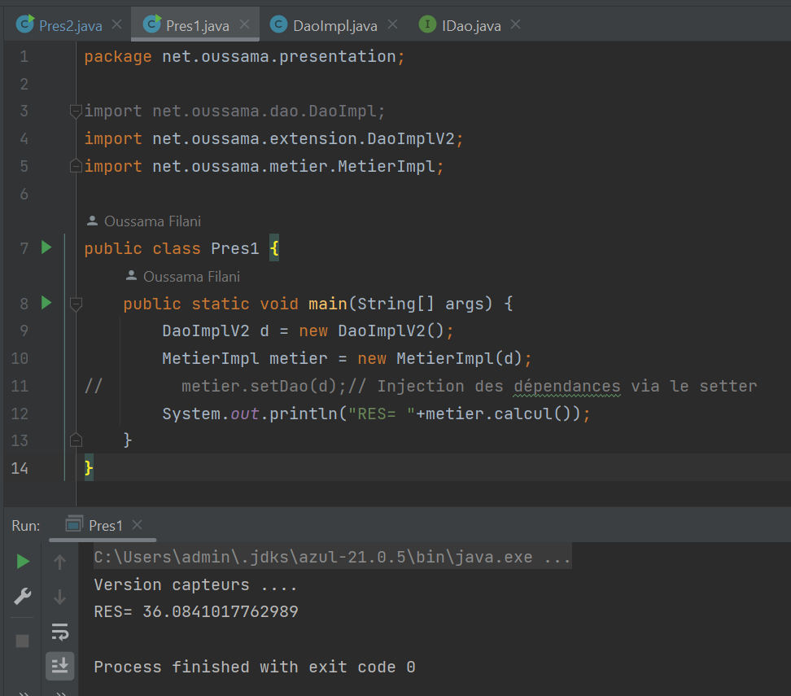
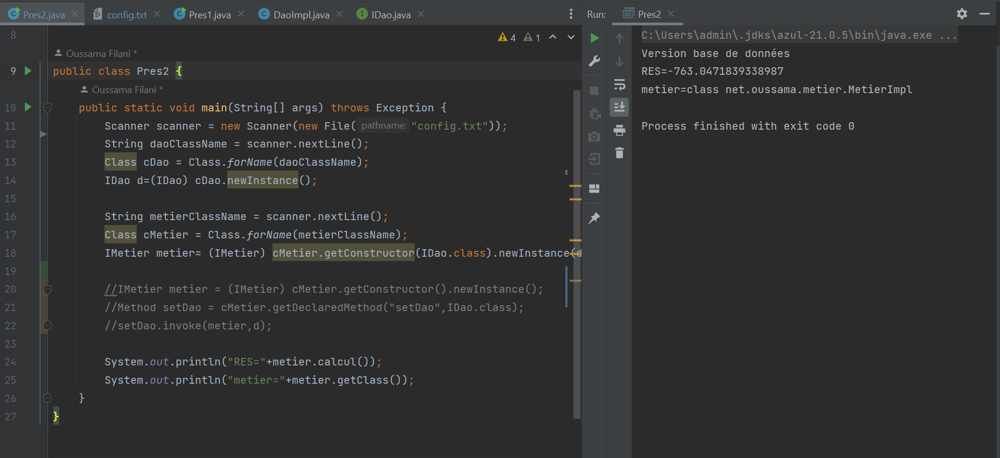
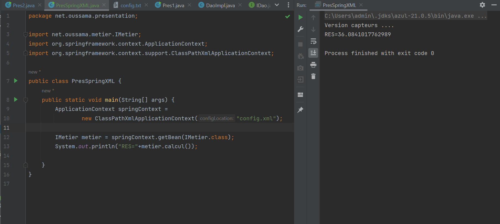

# 🏗️ Inversion de Contrôle (IoC) et Injection de Dépendances (DI) en Java

## 🎯 Objectif
Ce projet illustre les concepts d’**Inversion de Contrôle (IoC)** et d’**Injection de Dépendances (DI)** en Java, en explorant différentes méthodes d’injection :

- **Instanciation statique** (couplage fort)
- **Instanciation dynamique** (via réflexion Java)
- **Injection avec Spring** (configuration XML et annotations)

---

## 🛠️ Injection des Dépendances

### ✅ 1. Instanciation statique
Dans cette approche, les dépendances sont créées et injectées manuellement dans le code, ce qui crée un **couplage fort** entre les classes.

---

### ✅ 2. Instanciation dynamique
L’injection dynamique utilise **la réflexion Java** pour instancier les objets, ce qui **réduit le couplage** et permet une plus grande flexibilité.

---

### ✅ 3. Injection avec Spring

#### 🔹 a) Injection via un fichier XML
Avec **Spring XML**, la configuration des dépendances est centralisée dans un fichier, améliorant ainsi la modularité du projet.

#### 🔹 b) Injection via annotations
Spring permet également d’injecter les dépendances avec des **annotations**, réduisant ainsi la configuration nécessaire et simplifiant la gestion du projet.

---

## 🏁 Conclusion
Ce projet démontre plusieurs approches d’**Injection de Dépendances (DI)** et d’**Inversion de Contrôle (IoC)** en Java :

✔️ **Instanciation statique** → Couplage fort, difficile à maintenir  
✔️ **Instanciation dynamique** → Plus flexible grâce à la réflexion  
✔️ **Injection avec Spring** → Configuration XML ou annotations pour un code plus propre et maintenable

Grâce à ces techniques, on améliore la **réutilisation du code**, la **testabilité** et la **maintenabilité** du projet. 🚀  
